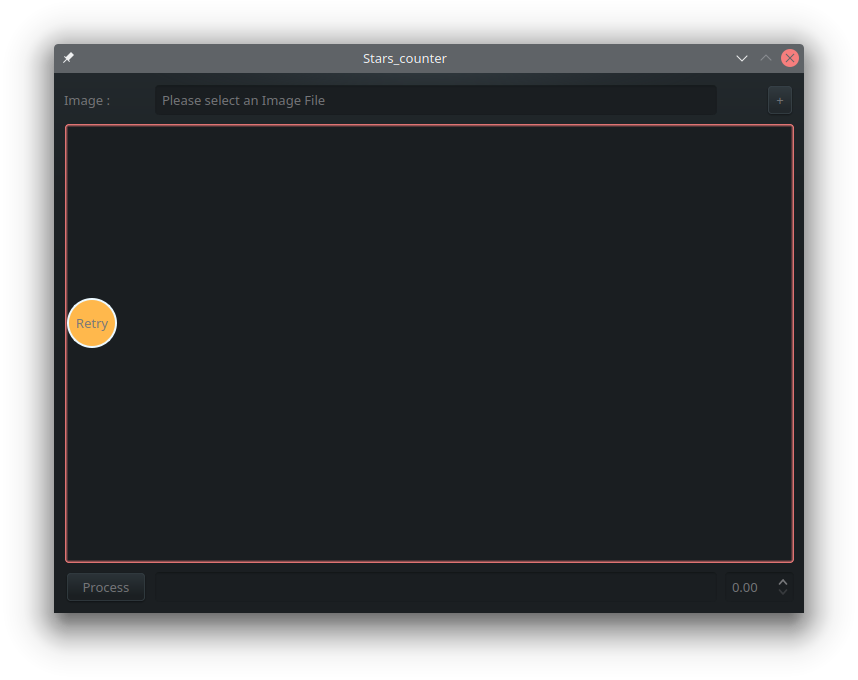
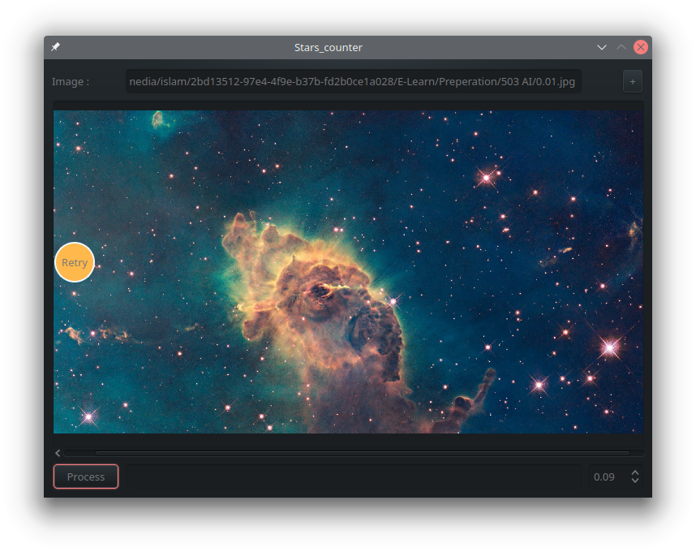
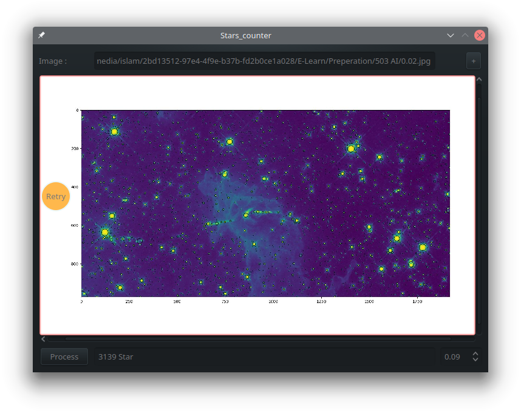

<p align="center">
  
</p>

# AI_StarsCounter
Stars_Counter is a tool for counting the number of stars within an image. UI created using QT5.
## Chat with us
- **Telegram:** [Islam_Trabeih](https://t.me/islamtrabeih)


## Running
1. Download and Install Python from the link https://www.python.org/downloads/  `python 3.10 is recommended`
2. Clone the Package using:
```
git clone https://github.com/Islamtrabeih/AI_StarsCounter
```
### Runing EXEC Files
Enter the directory where the EXEC file depending on your OS "Linux_EXEC Or WIN_EXE";
And just double click the exec file.

 > For linux users please don't forget to `chmod` of the file

 ### Running the Source file
 1. Install the required packages using the code:
```
pip install -r requirements.txt
```
> for linux users:
```
pip3 install -r requirements.txt
```
2. Run the source using the code:
```
python Process.py
```
> for linux users:
```
python3 Process.py
```
## Screenshots
A. Load                   |B. Choose                 |C. Process                       
--------------------------|--------------------------|--------------------------
 | | 
